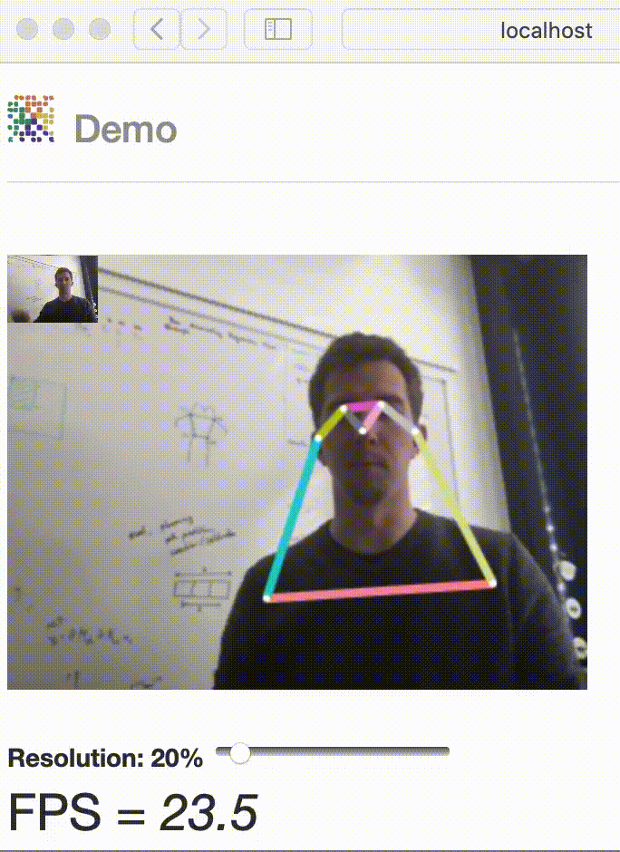
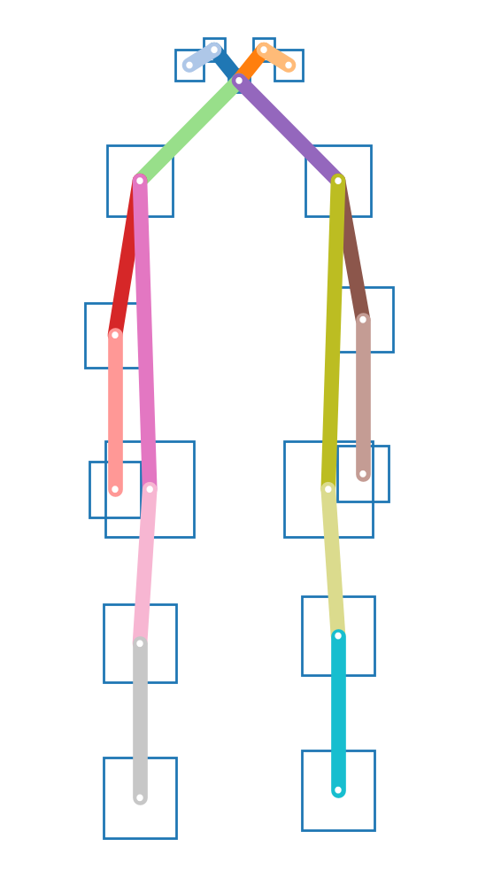
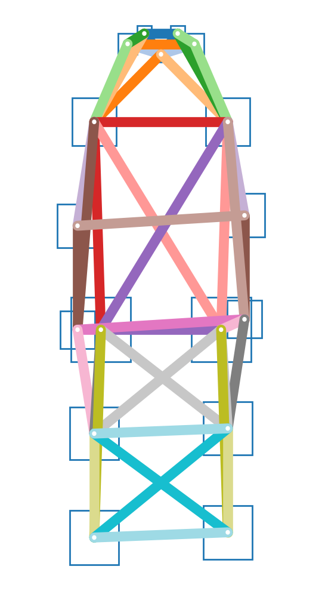

# openpifpaf

Continuously tested on Linux, MacOS and Windows: [](https://travis-ci.org/vita-epfl/openpifpaf)<br />
[CVPR 2019 paper](http://openaccess.thecvf.com/content_CVPR_2019/html/Kreiss_PifPaf_Composite_Fields_for_Human_Pose_Estimation_CVPR_2019_paper.html)
<!-- [arxiv.org/abs/1903.06593](https://arxiv.org/abs/1903.06593) -->

> PifPaf: Composite Fields for Human Pose Estimation
>
> We propose a new bottom-up method for multi-person 2D human pose
> estimation that is particularly well suited for urban mobility such as self-driving cars
> and delivery robots. The new method, PifPaf, uses a Part Intensity Field (PIF) to
> localize body parts and a Part Association Field (PAF) to associate body parts with each other to form
> full human poses.
> Our method outperforms previous methods at low resolution and in crowded,
> cluttered and occluded scenes
> thanks to (i) our new composite field PAF encoding fine-grained information and (ii) the choice of Laplace loss for regressions which incorporates a notion of uncertainty.
> Our architecture is based on a fully
> convolutional, single-shot, box-free design.
> We perform on par with the existing
> state-of-the-art bottom-up method on the standard COCO keypoint task
> and produce state-of-the-art results on a modified COCO keypoint task for
> the transportation domain.


# Demo


Image credit: "[Learning to surf](https://www.flickr.com/photos/fotologic/6038911779/in/photostream/)" by fotologic which is licensed under [CC-BY-2.0].<br />
Created with
`python3 -m openpifpaf.predict docs/coco/000000081988.jpg --show --image-output --json-output`
which also produces [json output](docs/coco/000000081988.jpg.predictions.json).

More demos:
* [openpifpafwebdemo](https://github.com/vita-epfl/openpifpafwebdemo) project (best performance)
* OpenPifPaf running in your browser: https://vita-epfl.github.io/openpifpafwebdemo/ (experimental)
* the `openpifpaf.video` command (requires OpenCV)
* [Google Colab demo](https://colab.research.google.com/drive/1H8T4ZE6wc0A9xJE4oGnhgHpUpAH5HL7W)




# Install

Python 3 is required. Python 2 is not supported.
Do not clone this repository
and make sure there is no folder named `openpifpaf` in your current directory.

```sh
pip3 install openpifpaf
```

For a live demo, we recommend to try the
[openpifpafwebdemo](https://github.com/vita-epfl/openpifpafwebdemo) project.
Alternatively, `openpifpaf.video` (requires OpenCV) provides a live demo as well.

For development of the openpifpaf source code itself, you need to clone this repository and then:

```sh
pip3 install numpy cython
pip3 install --editable '.[train,test]'
```

The last command installs the Python package in the current directory
(signified by the dot) with the optional dependencies needed for training and
testing. If you modify `functional.pyx`, run this last command again which
recompiles the static code.


# Interfaces

* `python3 -m openpifpaf.predict --help`: [help screen](docs/cli-help-predict.txt)
* `python3 -m openpifpaf.video --help`: [help screen](docs/cli-help-video.txt)
* `python3 -m openpifpaf.train --help`: [help screen](docs/cli-help-train.txt)
* `python3 -m openpifpaf.eval_coco --help`: [help screen](docs/cli-help-eval_coco.txt)
* `python3 -m openpifpaf.logs --help`: [help screen](docs/cli-help-logs.txt)

Tools to work with models:

* `python3 -m openpifpaf.migrate --help`: [help screen](docs/cli-help-migrate.txt)
* `python3 -m openpifpaf.export_onnx --help`: [help screen](docs/cli-help-export_onnx.txt)


# Pre-trained Models

Performance metrics with version 0.11 on the COCO val set obtained with a GTX1080Ti:

| Backbone               | AP       | APᴹ      | APᴸ      | t_{total} [ms]  | t_{dec} [ms] |
|-----------------------:|:--------:|:--------:|:--------:|:---------------:|:------------:|
| [shufflenetv2k16w]     | __67.1__ | 62.0     | 75.3     | 54              | 25           |
| [shufflenetv2k30w]     | __71.1__ | 65.9     | 79.1     | 94              | 22           |

[shufflenetv2k16w]: https://github.com/vita-epfl/openpifpaf-torchhub/releases/download/v0.11.0/shufflenetv2k16w-200510-221334-cif-caf-caf25-o10s-604c5956.pkl
[shufflenetv2k30w]: https://github.com/vita-epfl/openpifpaf-torchhub/releases/download/v0.11.0/shufflenetv2k30w-200510-104256-cif-caf-caf25-o10s-0b5ba06f.pkl

Command to reproduce this table: `python -m openpifpaf.benchmark --backbones shufflenetv2k16w shufflenetv2k30w`.

Pretrained model files are shared in the
__[openpifpaf-torchhub](https://github.com/vita-epfl/openpifpaf-torchhub/releases)__
repository and linked from the backbone names in the table above.
The pretrained models are downloaded automatically when
using the command line option `--checkpoint backbonenameasintableabove`.

For comparison, old v0.10:

| Backbone               | AP       | APᴹ      | APᴸ      | t_{total} [ms]  | t_{dec} [ms] |
|-----------------------:|:--------:|:--------:|:--------:|:---------------:|:------------:|
| shufflenetv2x2 v0.10   | __60.4__ | 55.5     | 67.8     | 56              | 33           |
| resnet50 v0.10         | __64.4__ | 61.1     | 69.9     | 76              | 32           |
| resnet101 v0.10        | __67.8__ | 63.6     | 74.3     | 97              | 28           |


# Train

See [datasets](docs/datasets.md) for setup instructions.

The exact training command that was used for a model is in the first
line of the training log file.

ShuffleNet models are trained without ImageNet pretraining:

```sh
time CUDA_VISIBLE_DEVICES=0,1 python3 -m openpifpaf.train \
  --lr=0.1 \
  --momentum=0.9 \
  --epochs=150 \
  --lr-warm-up-epochs=1 \
  --lr-decay 120 \
  --lr-decay-epochs=20 \
  --lr-decay-factor=0.1 \
  --batch-size=32 \
  --square-edge=385 \
  --lambdas 1 1 0.2   1 1 1 0.2 0.2    1 1 1 0.2 0.2 \
  --auto-tune-mtl \
  --weight-decay=1e-5 \
  --update-batchnorm-runningstatistics \
  --ema=0.01 \
  --basenet=shufflenetv2k16w \
  --headnets cif caf caf25

# for improved performance, take the epoch150 checkpoint and train with
# extended-scale and 10% orientation invariance:
time CUDA_VISIBLE_DEVICES=0,1 python3 -m openpifpaf.train \
  --lr=0.05 \
  --momentum=0.9 \
  --epochs=250 \
  --lr-warm-up-epochs=1 \
  --lr-decay 220 \
  --lr-decay-epochs=30 \
  --lr-decay-factor=0.01 \
  --batch-size=32 \
  --square-edge=385 \
  --lambdas 1 1 0.2   1 1 1 0.2 0.2    1 1 1 0.2 0.2 \
  --auto-tune-mtl \
  --weight-decay=1e-5 \
  --update-batchnorm-runningstatistics \
  --ema=0.01 \
  --checkpoint outputs/shufflenetv2k16w-200504-145520-cif-caf-caf25-d05e5520.pkl --extended-scale --orientation-invariant=0.1
```

You can refine an existing model with the `--checkpoint` option.

To visualize logs:

```sh
python3 -m openpifpaf.logs \
  outputs/resnet50block5-pif-paf-edge401-190424-122009.pkl.log \
  outputs/resnet101block5-pif-paf-edge401-190412-151013.pkl.log \
  outputs/resnet152block5-pif-paf-edge401-190412-121848.pkl.log
```

To produce evaluation metrics every five epochs and check the directory for new
checkpoints every 5 minutes:

```
while true; do \
  CUDA_VISIBLE_DEVICES=0 find outputs/ -name "shufflenetv2k16w-200504-145520-cif-caf-caf25.pkl.epoch??[0,5]" -exec \
    python3 -m openpifpaf.eval_coco --checkpoint {} -n 500 --long-edge=641 --skip-existing \; \
  ; \
  sleep 300; \
done
```


# Person Skeletons

COCO / kinematic tree / dense:



Created with `python3 -m openpifpaf.datasets.constants`.


# Video

Requires OpenCV.

```sh
python3 -m openpifpaf.video --checkpoint shufflenetv2k16w myvideotoprocess.mp4 --video-output --json-output
```

Replace `myvideotoprocess.mp4` with `0` for webcam0 or other OpenCV compatible sources.


# Documentation Pages

* [datasets](docs/datasets.md)
* [predict.ipynb](docs/predict.ipynb), on [Google Colab](https://colab.research.google.com/drive/1H8T4ZE6wc0A9xJE4oGnhgHpUpAH5HL7W)
* [evaluation logs](docs/eval_logs.md)
* [history](HISTORY.md)
* [contributing](CONTRIBUTING.md)


# Related Projects

* [monoloco](https://github.com/vita-epfl/monoloco): "Monocular 3D Pedestrian Localization and Uncertainty Estimation" which uses OpenPifPaf for poses.
* [openpifpafwebdemo](https://github.com/vita-epfl/openpifpafwebdemo): web front-end.


# Citation

```
@InProceedings{kreiss2019pifpaf,
  author = {Kreiss, Sven and Bertoni, Lorenzo and Alahi, Alexandre},
  title = {PifPaf: Composite Fields for Human Pose Estimation},
  booktitle = {The IEEE Conference on Computer Vision and Pattern Recognition (CVPR)},
  month = {June},
  year = {2019}
}
```


[CC-BY-2.0]: https://creativecommons.org/licenses/by/2.0/
