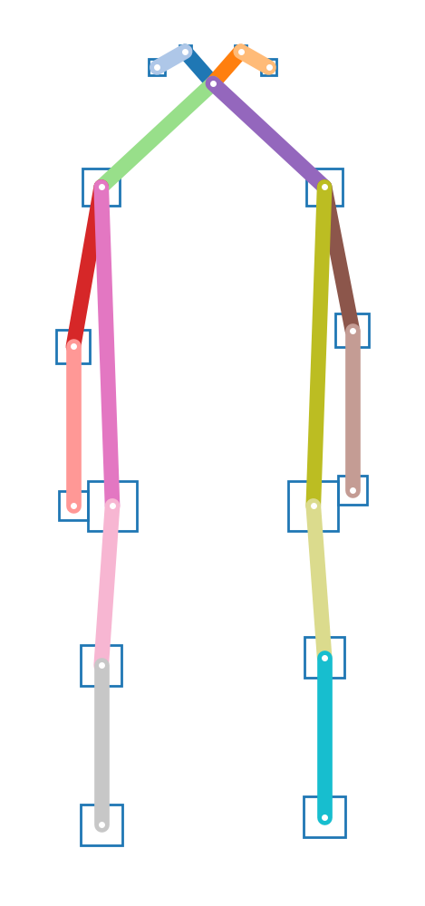

# openpifpaf

[](https://travis-ci.org/vita-epfl/openpifpaf)

> We propose a new bottom-up method for multi-person 2D human pose
> estimation that is particularly well suited for urban mobility such as self-driving cars
> and delivery robots. The new method, PifPaf, uses a Part Intensity Field (PIF) to
> localize body parts and a Part Association Field (PAF) to associate body parts with each other to form
> full human poses.
> Our method outperforms previous methods at low resolution and in crowded,
> cluttered and occluded scenes
> thanks to (i) our new composite field PAF encoding fine-grained information and (ii) the choice of Laplace loss for regressions which incorporates a notion of uncertainty.
> Our architecture is based on a fully
> convolutional, single-shot, box-free design.
> We perform on par with the existing
> state-of-the-art bottom-up method on the standard COCO keypoint task
> and produce state-of-the-art results on a modified COCO keypoint task for
> the transportation domain.


```
@article{kreiss2019pifpaf,
  title = {PifPaf: Composite Fields for Human Pose Estimation},
  author = {Kreiss, Sven and Bertoni, Lorenzo and Alahi, Alexandre},
  journal = {CVPR},
  year = {2019}
}
```


# Demo


Image credit: "[Learning to surf](https://www.flickr.com/photos/fotologic/6038911779/in/photostream/)" by fotologic which is licensed under [CC-BY-2.0].


Created with:

```sh
python -m openpifpaf.predict \
  --checkpoint outputs/resnet101block5-pifs-pafs-edge401-l1-190131-083451.pkl \
  data-mscoco/images/val2017/000000081988.jpg -o docs/coco/ --show
```


# Install

```sh
pip install numpy cython
pip install 'openpifpaf[train,test]'

# from source:
pip install --editable '.[train,test]'
```

OpenCV is required for ``openpifpaf.webcam``. To use a globally installed
OpenCV from inside a virtual environment, create the virtualenv with the
``--system-site-packages`` option and verify that you can do ``import cv2``.


# Interfaces

* `python -m openpifpaf.train --help`
* `python -m openpifpaf.eval_coco --help`
* `python -m openpifpaf.logs --help`
* `python -m openpifpaf.predict --help`
* `python -m openpifpaf.webcam --help`

Example commands to try:

```sh
# live demo
MPLBACKEND=macosx python -m openpifpaf.webcam --scale 0.1 --source=0

# single image
python -m openpifpaf.predict my_image.jpg --show
```


# Pre-trained Networks

Put these files into your `outputs` folder: [Google Drive](https://drive.google.com/drive/folders/1v8UNDjZbqeMZY64T33tSDOq1jtcBJBy7?usp=sharing>)

Visualize logs:

```sh
python -m pifpaf.logs \
  outputs/resnet50-pif-paf-rsmooth0.5-181209-192001.pkl.log \
  outputs/resnet101-pif-paf-rsmooth0.5-181213-224234.pkl.log \
  outputs/resnet152-pif-paf-l1-181230-201001.pkl.log
```


# Train

See [datasets](docs/datasets.md) for setup instructions.
See [studies.ipynb](docs/studies.ipynb) for previous studies.

Train a model:

```sh
python -m openpifpaf.train \
  --lr=1e-3 \
  --epochs=75 \
  --lr-decay 60 70 \
  --batch-size=8 \
  --basenet=resnet50block5 \
  --headnets pif paf \
  --square-edge=401 \
  --regression-loss=laplace \
  --lambdas 30 2 2 50 3 3 \
  --freeze-base=1
```

You can refine an existing model with the `--checkpoint` option.

To produce evaluations at every epoch, check the directory for new
snapshots every 5 minutes:

```
while true; do \
  CUDA_VISIBLE_DEVICES=0 find outputs/ -name "resnet101block5-pif-paf-l1-190109-113346.pkl.epoch???" -exec \
    python -m openpifpaf.eval_coco --checkpoint {} -n 500 --long-edge=641 --skip-existing \; \
  ; \
  sleep 300; \
done
```


# Person Skeletons

COCO / kinematic tree / dense:



Created with `python -m openpifpaf.data`.


# Video

Processing a video frame by frame from ``video.avi`` to ``video-pose.mp4`` using ffmpeg:

```sh
ffmpeg -i video.avi -qscale:v 2 -vf scale=641:-1 -f image2 video-%05d.jpg
python -m openpifpaf.predict --checkpoint outputs/resnet101block5-pifs-pafs-edge401-l1-190213-100439.pkl video-*0.jpg
ffmpeg -framerate 24 -pattern_type glob -i 'video-*.jpg.skeleton.png' -vf scale=640:-1 -c:v libx264 -pix_fmt yuv420p video-pose.mp4
```


# Evaluations

See [evaluation logs](docs/eval_logs.md) for a long list.
This result was produced with `python -m openpifpaf.eval_coco --checkpoint outputs/resnet101block5-pif-paf-edge401-190313-100107.pkl --long-edge=641 --loader-workers=8`:

```
Average Precision  (AP) @[ IoU=0.50:0.95 | area=   all | maxDets= 20 ] = 0.662
Average Precision  (AP) @[ IoU=0.50      | area=   all | maxDets= 20 ] = 0.872
Average Precision  (AP) @[ IoU=0.75      | area=   all | maxDets= 20 ] = 0.724
Average Precision  (AP) @[ IoU=0.50:0.95 | area=medium | maxDets= 20 ] = 0.623
Average Precision  (AP) @[ IoU=0.50:0.95 | area= large | maxDets= 20 ] = 0.721
Average Recall     (AR) @[ IoU=0.50:0.95 | area=   all | maxDets= 20 ] = 0.712
Average Recall     (AR) @[ IoU=0.50      | area=   all | maxDets= 20 ] = 0.895
Average Recall     (AR) @[ IoU=0.75      | area=   all | maxDets= 20 ] = 0.768
Average Recall     (AR) @[ IoU=0.50:0.95 | area=medium | maxDets= 20 ] = 0.660
Average Recall     (AR) @[ IoU=0.50:0.95 | area= large | maxDets= 20 ] = 0.785
```


[CC-BY-2.0]: https://creativecommons.org/licenses/by/2.0/
