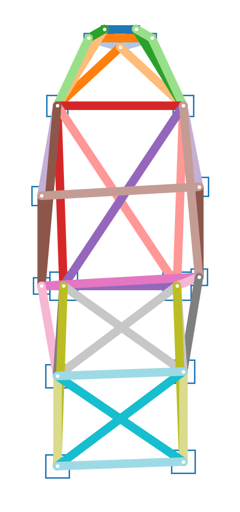

# openpifpaf

Continuously tested on Linux, MacOS and Windows: [](https://travis-ci.org/vita-epfl/openpifpaf)

> We propose a new bottom-up method for multi-person 2D human pose
> estimation that is particularly well suited for urban mobility such as self-driving cars
> and delivery robots. The new method, PifPaf, uses a Part Intensity Field (PIF) to
> localize body parts and a Part Association Field (PAF) to associate body parts with each other to form
> full human poses.
> Our method outperforms previous methods at low resolution and in crowded,
> cluttered and occluded scenes
> thanks to (i) our new composite field PAF encoding fine-grained information and (ii) the choice of Laplace loss for regressions which incorporates a notion of uncertainty.
> Our architecture is based on a fully
> convolutional, single-shot, box-free design.
> We perform on par with the existing
> state-of-the-art bottom-up method on the standard COCO keypoint task
> and produce state-of-the-art results on a modified COCO keypoint task for
> the transportation domain.


```
@InProceedings{kreiss2019pifpaf,
  author = {Kreiss, Sven and Bertoni, Lorenzo and Alahi, Alexandre},
  title = {PifPaf: Composite Fields for Human Pose Estimation},
  booktitle = {The IEEE Conference on Computer Vision and Pattern Recognition (CVPR)},
  month = {June},
  year = {2019}
}
```

[CVPR 2019 website](http://openaccess.thecvf.com/content_CVPR_2019/html/Kreiss_PifPaf_Composite_Fields_for_Human_Pose_Estimation_CVPR_2019_paper.html),
[arxiv.org/abs/1903.06593](https://arxiv.org/abs/1903.06593)


# Demo


Image credit: "[Learning to surf](https://www.flickr.com/photos/fotologic/6038911779/in/photostream/)" by fotologic which is licensed under [CC-BY-2.0].<br />
Created with:
`python3 -m openpifpaf.predict --show docs/coco/000000081988.jpg`

More demos:
* [openpifpafwebdemo](https://github.com/vita-epfl/openpifpafwebdemo) project (best performance)
* OpenPifPaf running in your browser: https://vita-epfl.github.io/openpifpafwebdemo/ (experimental)
* the `openpifpaf.webcam` command (requires OpenCV)
* [Google Colab demo](https://colab.research.google.com/drive/1H8T4ZE6wc0A9xJE4oGnhgHpUpAH5HL7W)


# Install

Python 3 is required. Python 2 is not supported.
Do not clone this repository
and make sure there is no folder named `openpifpaf` in your current directory.

```sh
pip3 install openpifpaf
```

For a live demo, we recommend to try the
[openpifpafwebdemo](https://github.com/vita-epfl/openpifpafwebdemo) project.
Alternatively, `openpifpaf.webcam` provides a live demo as well.
It requires OpenCV.

For development of the openpifpaf source code itself, you need to clone this repository and then:

```sh
pip3 install numpy cython
pip3 install --editable '.[train,test]'
```

The last command installs the Python package in the current directory
(signified by the dot) with the optional dependencies needed for training and
testing.


# Interfaces

* `python3 -m openpifpaf.predict --help`: [help screen](docs/cli-help-predict.txt)
* `python3 -m openpifpaf.webcam --help`: [help screen](docs/cli-help-webcam.txt)
* `python3 -m openpifpaf.train --help`: [help screen](docs/cli-help-train.txt)
* `python3 -m openpifpaf.eval_coco --help`: [help screen](docs/cli-help-eval_coco.txt)
* `python3 -m openpifpaf.logs --help`: [help screen](docs/cli-help-logs.txt)

Tools to work with models:

* `python3 -m openpifpaf.migrate --help`: [help screen](docs/cli-help-migrate.txt)
* `python3 -m openpifpaf.export_onnx --help`: [help screen](docs/cli-help-export_onnx.txt)


# Pre-trained Models

Performance metrics with version 0.10.0 on the COCO val set obtained with a GTX1080Ti:

| Backbone               | AP       | APᴹ      | APᴸ      | t_{total} [ms]  | t_{dec} [ms] |
|-----------------------:|:--------:|:--------:|:--------:|:---------------:|:------------:|
| shufflenetv2x2         | __60.4__ | 55.3     | 68.1     | 80              | 56           |
| resnet50               | __64.6__ | 61.1     | 70.2     | 100             | 55           |
| (v0.8) resnext50       | __63.8__ | 61.1     | 68.1     | 93              | 33           |
| resnet101              | __67.9__ | 63.6     | 74.7     | 120             | 51           |
| (v0.8) resnet152       | __67.8__ | 64.4     | 73.3     | 122             | 30           |

Pretrained model files are shared in the releases of the
__[openpifpaf-torchhub](https://github.com/vita-epfl/openpifpaf-torchhub)__
repository. The pretrained models are downloaded automatically when
using the command line option `--checkpoint backbonenameasintableabove`.

To visualize logs:

```sh
python3 -m openpifpaf.logs \
  outputs/resnet50block5-pif-paf-edge401-190424-122009.pkl.log \
  outputs/resnet101block5-pif-paf-edge401-190412-151013.pkl.log \
  outputs/resnet152block5-pif-paf-edge401-190412-121848.pkl.log
```


# Train

See [datasets](docs/datasets.md) for setup instructions.
See [studies.ipynb](docs/studies.ipynb) for previous studies.

The exact training command that was used for a model is in the first
line of the training log file.

Train a ResNet model:

```sh
time CUDA_VISIBLE_DEVICES=0,1 python3 -m openpifpaf.train \
  --lr=1e-3 \
  --momentum=0.95 \
  --epochs=150 \
  --lr-decay 120 140 \
  --batch-size=16 \
  --basenet=resnet101 \
  --head-quad=1 \
  --headnets pif paf paf25 \
  --square-edge=401 \
  --regression-loss=laplace \
  --lambdas 10 1 1 15 1 1 15 1 1
```

ShuffleNet models are trained without ImageNet pretraining:

```sh
time CUDA_VISIBLE_DEVICES=0,1 python3 -m openpifpaf.train \
  --batch-size=64 \
  --basenet=shufflenetv2x2 \
  --head-quad=1 \
  --epochs=150 \
  --momentum=0.9 \
  --headnets pif paf paf25 \
  --lambdas 30 2 2 50 3 3 50 3 3 \
  --loader-workers=16 \
  --lr=0.1 \
  --lr-decay 120 140 \
  --no-pretrain \
  --weight-decay=1e-5 \
  --update-batchnorm-runningstatistics \
  --ema=0.03
```

You can refine an existing model with the `--checkpoint` option.

To produce evaluations at every epoch, check the directory for new
snapshots every 5 minutes:

```
while true; do \
  CUDA_VISIBLE_DEVICES=0 find outputs/ -name "resnet101block5-pif-paf-l1-190109-113346.pkl.epoch???" -exec \
    python3 -m openpifpaf.eval_coco --checkpoint {} -n 500 --long-edge=641 --skip-existing \; \
  ; \
  sleep 300; \
done
```


# Person Skeletons

COCO / kinematic tree / dense:



Created with `python3 -m openpifpaf.data`.


# Video

Processing a video frame by frame from `video.avi` to `video.pose.mp4` using ffmpeg:

```sh
export VIDEO=video.avi  # change to your video file

mkdir ${VIDEO}.images
ffmpeg -i ${VIDEO} -qscale:v 2 -vf scale=641:-1 -f image2 ${VIDEO}.images/%05d.jpg
python3 -m openpifpaf.predict --checkpoint resnet152 --glob "${VIDEO}.images/*.jpg"
ffmpeg -framerate 24 -pattern_type glob -i ${VIDEO}.images/'*.jpg.skeleton.png' -vf scale=640:-2 -c:v libx264 -pix_fmt yuv420p ${VIDEO}.pose.mp4
```

In this process, ffmpeg scales the video to `641px` which can be adjusted.


# Documentation Pages

* [datasets](docs/datasets.md)
* [Google Colab demo](https://colab.research.google.com/drive/1H8T4ZE6wc0A9xJE4oGnhgHpUpAH5HL7W)
* [studies.ipynb](docs/studies.ipynb)
* [evaluation logs](docs/eval_logs.md)
* [performance analysis](docs/performance.md)
* [history](HISTORY.md)
* [contributing](CONTRIBUTING.md)


# Related Projects

* [monoloco](https://github.com/vita-epfl/monoloco): "Monocular 3D Pedestrian Localization and Uncertainty Estimation" which uses OpenPifPaf for poses.
* [openpifpafwebdemo](https://github.com/vita-epfl/openpifpafwebdemo): web front-end.


[CC-BY-2.0]: https://creativecommons.org/licenses/by/2.0/
