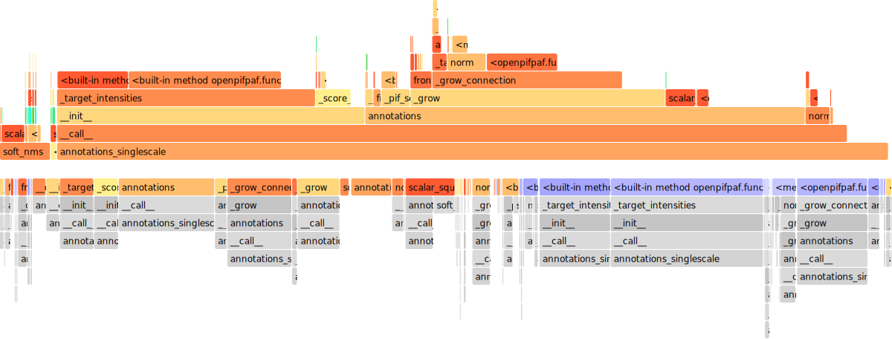

# Performance Studies

Might be out of date.


# Profiling Decoder


Run predict with the `--profile` option:

```sh
python3 -m openpifpaf.predict --checkpoint resnet152 \
  docs/coco/000000081988.jpg --show --profile --debug
```

This will write a stats table to the terminal and also produce a `decoder.prof` file.
You can use flameprof (`pip install flameprof`) to get a flame graph with
`flameprof decoder.prof > docs/coco/000000081988.jpg.decoder_flame.svg`:


### Large image

e.g., from NuScenes:


```
python3 -m openpifpaf.predict --checkpoint resnet152 \
  docs/nuscenes/test.jpg --show --profile --debug
```

Then create the flame graph with
`flameprof decoder.prof > docs/nuscenes/test.jpg.decoder_flame.svg` to produce:


### Crowded image


```
python3 -m openpifpaf.predict --checkpoint resnet152 \
  docs/crowd.png --show --profile --debug
```

Then create the flame graph with
`flameprof decoder.prof > docs/crowd.png.decoder_flame.svg` to produce:




### Low quality crowded scene


```
python3 -m openpifpaf.predict --checkpoint resnet152 \
  docs/mochit_station_example.jpg --show --profile --debug
```

Then create the flame graph with
`flameprof decoder.prof > docs/mochit_station_example.jpg.decoder_flame.svg` to produce:


