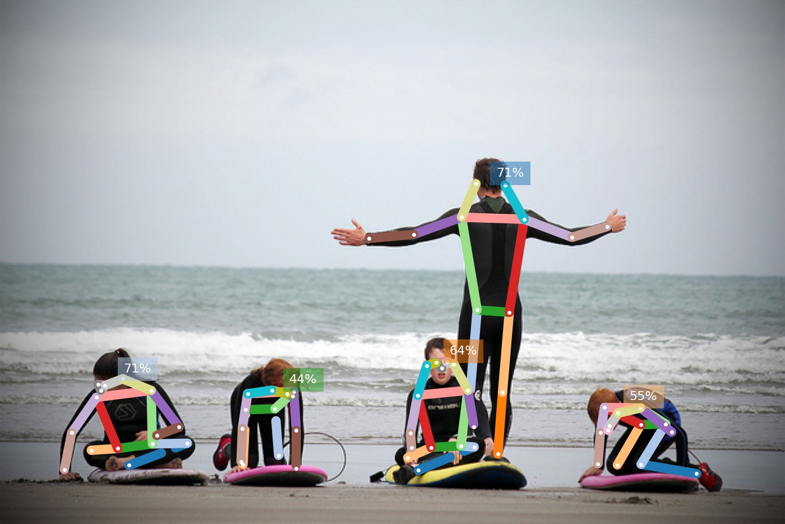

(introduction)=
# Introduction

Continuously tested on Linux, MacOS and Windows:
[](https://github.com/vita-epfl/openpifpaf/actions?query=workflow%3ATests)
[](https://github.com/vita-epfl/openpifpaf/actions?query=workflow%3Adeploy-guide)
[](https://pepy.tech/project/openpifpaf)
<br />
[__New__ 2021 paper](https://arxiv.org/abs/2103.02440):

> __OpenPifPaf: Composite Fields for Semantic Keypoint Detection and Spatio-Temporal Association__<br />
> _[Sven Kreiss](https://www.svenkreiss.com), [Lorenzo Bertoni](https://scholar.google.com/citations?user=f-4YHeMAAAAJ&hl=en), [Alexandre Alahi](https://scholar.google.com/citations?user=UIhXQ64AAAAJ&hl=en)_, 2021.
>
> Many image-based perception tasks can be formulated as detecting, associating
> and tracking semantic keypoints, e.g., human body pose estimation and tracking.
> In this work, we present a general framework that jointly detects and forms
> spatio-temporal keypoint associations in a single stage, making this the first
> real-time pose detection and tracking algorithm. We present a generic neural
> network architecture that uses Composite Fields to detect and construct a
> spatio-temporal pose which is a single, connected graph whose nodes are the
> semantic keypoints (e.g., a person's body joints) in multiple frames. For the
> temporal associations, we introduce the Temporal Composite Association Field
> (TCAF) which requires an extended network architecture and training method
> beyond previous Composite Fields. Our experiments show competitive accuracy
> while being an order of magnitude faster on multiple publicly available datasets
> such as COCO, CrowdPose and the PoseTrack 2017 and 2018 datasets. We also show
> that our method generalizes to any class of semantic keypoints such as car and
> animal parts to provide a holistic perception framework that is well suited for
> urban mobility such as self-driving cars and delivery robots.

Previous [CVPR 2019 paper](http://openaccess.thecvf.com/content_CVPR_2019/html/Kreiss_PifPaf_Composite_Fields_for_Human_Pose_Estimation_CVPR_2019_paper.html).


## Demo



Image credit: "[Learning to surf](https://www.flickr.com/photos/fotologic/6038911779/in/photostream/)" by fotologic which is licensed under [CC-BY-2.0].<br />
Created with
{ref}`python3 -m openpifpaf.predict docs/coco/000000081988.jpg --image-min-dpi=200 --show-file-extension=jpeg --image-output <cli-help-predict>`.

More demos:
* [openpifpafwebdemo](https://github.com/vita-epfl/openpifpafwebdemo) project (best performance). [Live](https://vitademo.epfl.ch).
* OpenPifPaf [running in your browser: vita-epfl.github.io/openpifpafwebdemo](https://vita-epfl.github.io/openpifpafwebdemo/) (experimental)
* the {ref}`python3 -m openpifpaf.video <cli-help-video>` command (requires OpenCV)
* [Google Colab demo](https://colab.research.google.com/drive/1H8T4ZE6wc0A9xJE4oGnhgHpUpAH5HL7W)

```{image} ../docs/wave3.gif
:height: "250"
```


## Install

Python 3 is required. Python 2 is not supported.
Do not clone this repository
and make sure there is no folder named `openpifpaf` in your current directory.

```sh
pip3 install openpifpaf
```

You need to install `matplotlib` to produce visual outputs.

To modify openpifpaf itself, please follow {ref}`modify-code`.

For a live demo, we recommend to try the
[openpifpafwebdemo](https://github.com/vita-epfl/openpifpafwebdemo) project.
Alternatively, {ref}`python3 -m openpifpaf.video <cli-help-video>` (requires OpenCV)
provides a live demo as well.


## About this Guide

This is an executable book.
Many sections of this book, like {doc}`predict_cli`, are generated from the code
shown on the page itself:
most pages are based on Jupyter Notebooks
that can be downloaded or launched interactively in the cloud by clicking on the rocket
at the top and selecting a cloud provider like _Binder_.
The code on the page is all the code required to reproduce that particular page.


## Pre-trained Models

Performance metrics with version 0.11 on the COCO val set obtained with a GTX1080Ti:

| Checkpoint                | AP       | APᴹ      | APᴸ      | t_{total} [ms]  | t_{dec} [ms] |     size |
|--------------------------:|:--------:|:--------:|:--------:|:---------------:|:------------:|---------:|
| [resnet50]                | __68.2__ | 65.8     | 72.7     | 64              | 22           |   98.0MB |
| [shufflenetv2k16]         | __67.2__ | 62.7     | 74.6     | 51              | 19           |   39.3MB |
| [shufflenetv2k30]         | __71.0__ | 66.6     | 78.5     | 92              | 16           |  115.6MB |

[resnet50]: https://github.com/vita-epfl/openpifpaf-torchhub/releases/download/v0.12.2/resnet50-210224-202010-cocokp-o10s-d020d7f1.pkl
[shufflenetv2k16]: https://github.com/vita-epfl/openpifpaf-torchhub/releases/download/v0.12b4/shufflenetv2k16-210214-123448-cocokp-o10s-e2ae3708.pkl
[shufflenetv2k30]: https://github.com/vita-epfl/openpifpaf-torchhub/releases/download/v0.12.2/shufflenetv2k30-210224-074128-cocokp-o10s-59ca2b89.pkl

Command to reproduce this table: {ref}`python -m openpifpaf.benchmark --checkpoints resnet50 shufflenetv2k16 shufflenetv2k30 <cli-help-benchmark>`.

Pretrained model files are shared in the
__[openpifpaf-torchhub](https://github.com/vita-epfl/openpifpaf-torchhub/releases)__
repository and linked from the checkpoint names in the table above.
The pretrained models are downloaded automatically when
using the command line option `--checkpoint checkpointasintableabove`.


## Related Projects

* [pose tracker](https://github.com/vita-epfl/openpifpaf_posetrack): "OpenPifPaf: Composite Fields for Semantic Keypoint Detection and Spatio-Temporal Association".
* [neuralet](https://neuralet.com/article/pose-estimation-on-nvidia-jetson-platforms-using-openpifpaf/): TensorRT execution, including Docker images for NVidia Jetson.
* [fall detection using pose estimation](https://towardsdatascience.com/fall-detection-using-pose-estimation-a8f7fd77081d): illustrated with many example video clips.
* [physio pose](https://medium.com/@_samkitjain/physio-pose-a-virtual-physiotherapy-assistant-7d1c17db3159): "A virtual physiotherapy assistant".
* [monstereo](https://github.com/vita-epfl/monstereo): "MonStereo: When Monocular and Stereo Meet at the Tail of 3D Human Localization".
* [monoloco](https://github.com/vita-epfl/monoloco): "Monocular 3D Pedestrian Localization and Uncertainty Estimation".
* [openpifpafwebdemo](https://github.com/vita-epfl/openpifpafwebdemo): Web server and frontend. Docker image. Kubernetes config. [Live](https://vitademo.epfl.ch).
* [GitHub dependency graph](https://github.com/vita-epfl/openpifpaf/network/dependents): auto-detected Github repositories that use OpenPifPaf.

Open an [issue](https://github.com/vita-epfl/openpifpaf/issues) to suggest more projects.


## Citation

```
@article{kreiss2021openpifpaf,
  title = {{OpenPifPaf: Composite Fields for Semantic Keypoint Detection and Spatio-Temporal Association}},
  author = {Sven Kreiss and Lorenzo Bertoni and Alexandre Alahi},
  journal = {arXiv preprint arXiv:2103.02440},
  month = {March},
  year = {2021}
}

@InProceedings{kreiss2019pifpaf,
  author = {Kreiss, Sven and Bertoni, Lorenzo and Alahi, Alexandre},
  title = {{PifPaf: Composite Fields for Human Pose Estimation}},
  booktitle = {The IEEE Conference on Computer Vision and Pattern Recognition (CVPR)},
  month = {June},
  year = {2019}
}
```
References: {cite}`kreiss2021openpifpaf, kreiss2019pifpaf`

[CC-BY-2.0]: https://creativecommons.org/licenses/by/2.0/


```{bibliography}
:style: unsrtalpha
```


## Commercial License

This software is available for licensing via the EPFL Technology Transfer
Office ([https://tto.epfl.ch/](https://tto.epfl.ch/), [info.tto@epfl.ch](mailto:info.tto@epfl.ch)).
