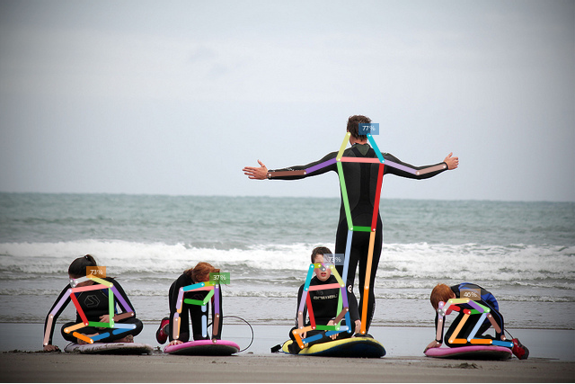

# Introduction

```{note}
Under construction.
```

Continuously tested on Linux, MacOS and Windows: [](https://travis-ci.org/vita-epfl/openpifpaf)<br />
[CVPR 2019 paper](http://openaccess.thecvf.com/content_CVPR_2019/html/Kreiss_PifPaf_Composite_Fields_for_Human_Pose_Estimation_CVPR_2019_paper.html)
<!-- [arxiv.org/abs/1903.06593](https://arxiv.org/abs/1903.06593) -->

> PifPaf: Composite Fields for Human Pose Estimation
>
> We propose a new bottom-up method for multi-person 2D human pose
> estimation that is particularly well suited for urban mobility such as self-driving cars
> and delivery robots. The new method, PifPaf, uses a Part Intensity Field (PIF) to
> localize body parts and a Part Association Field (PAF) to associate body parts with each other to form
> full human poses.
> Our method outperforms previous methods at low resolution and in crowded,
> cluttered and occluded scenes
> thanks to (i) our new composite field PAF encoding fine-grained information and (ii) the choice of Laplace loss for regressions which incorporates a notion of uncertainty.
> Our architecture is based on a fully
> convolutional, single-shot, box-free design.
> We perform on par with the existing
> state-of-the-art bottom-up method on the standard COCO keypoint task
> and produce state-of-the-art results on a modified COCO keypoint task for
> the transportation domain.


## Demo



Image credit: "[Learning to surf](https://www.flickr.com/photos/fotologic/6038911779/in/photostream/)" by fotologic which is licensed under [CC-BY-2.0].<br />
Created with
`python3 -m openpifpaf.predict docs/coco/000000081988.jpg --image-output`.

More demos:
* [openpifpafwebdemo](https://github.com/vita-epfl/openpifpafwebdemo) project (best performance)
* OpenPifPaf running in your browser: https://vita-epfl.github.io/openpifpafwebdemo/ (experimental)
* the `openpifpaf.video` command (requires OpenCV)
* [Google Colab demo](https://colab.research.google.com/drive/1H8T4ZE6wc0A9xJE4oGnhgHpUpAH5HL7W)

```{image} ../docs/wave3.gif
:height: "250"
```


## Install

Python 3 is required. Python 2 is not supported.
Do not clone this repository
and make sure there is no folder named `openpifpaf` in your current directory.

```sh
pip3 install openpifpaf
```

You need to install `matplotlib` to produce visual outputs.

For a live demo, we recommend to try the
[openpifpafwebdemo](https://github.com/vita-epfl/openpifpafwebdemo) project.
Alternatively, `openpifpaf.video` (requires OpenCV) provides a live demo as well.


## About this Guide

This is an autogenerated book.
Many sections of this book, like {doc}`predict_cli`, are interactive:
they are based on Jupyter Notebooks
that can be launched interactively in the cloud by clicking on the rocket
at the top and selecting a cloud provider like _Binder_.
This is also the reason why some pages contain quite a bit of code: this is
all the code required for regenerating that particular page.

__Syntax__: Some code blocks start with an exclamation point "`!`". It means
that this command is executed on the command line. You can run the same command
yourself without the exclamation point.


## Pre-trained Models

Performance metrics with version 0.11 on the COCO val set obtained with a GTX1080Ti:

| Backbone                  | AP       | APᴹ      | APᴸ      | t_{total} [ms]  | t_{dec} [ms] |     size |
|--------------------------:|:--------:|:--------:|:--------:|:---------------:|:------------:|---------:|
| [resnet50]                | __67.8__ | 65.3     | 72.6     | 70              | 28           |  105.0MB |
| [shufflenetv2k16w]        | __67.3__ | 62.2     | 75.3     | 54              | 25           |   43.9MB |
| [shufflenetv2k30w]        | __71.1__ | 66.0     | 79.0     | 94              | 22           |  122.3MB |

[resnet50]: https://github.com/vita-epfl/openpifpaf-torchhub/releases/download/v0.11.2/resnet50-200527-171310-cif-caf-caf25-o10s-c0b7ae80.pkl
[shufflenetv2k16w]: https://github.com/vita-epfl/openpifpaf-torchhub/releases/download/v0.11.0/shufflenetv2k16w-200510-221334-cif-caf-caf25-o10s-604c5956.pkl
[shufflenetv2k30w]: https://github.com/vita-epfl/openpifpaf-torchhub/releases/download/v0.11.0/shufflenetv2k30w-200510-104256-cif-caf-caf25-o10s-0b5ba06f.pkl

Command to reproduce this table: `python -m openpifpaf.benchmark --backbones shufflenetv2k16w shufflenetv2k30w`.

Pretrained model files are shared in the
__[openpifpaf-torchhub](https://github.com/vita-epfl/openpifpaf-torchhub/releases)__
repository and linked from the backbone names in the table above.
The pretrained models are downloaded automatically when
using the command line option `--checkpoint backbonenameasintableabove`.

For comparison, old v0.10:

| Backbone               | AP       | APᴹ      | APᴸ      | t_{total} [ms]  | t_{dec} [ms] |
|-----------------------:|:--------:|:--------:|:--------:|:---------------:|:------------:|
| shufflenetv2x2 v0.10   | __60.4__ | 55.5     | 67.8     | 56              | 33           |
| resnet50 v0.10         | __64.4__ | 61.1     | 69.9     | 76              | 32           |
| resnet101 v0.10        | __67.8__ | 63.6     | 74.3     | 97              | 28           |


## Related Projects

* [monoloco](https://github.com/vita-epfl/monoloco): "Monocular 3D Pedestrian Localization and Uncertainty Estimation" which uses OpenPifPaf for poses.
* [openpifpafwebdemo](https://github.com/vita-epfl/openpifpafwebdemo): web front-end.


## Citation

```
@InProceedings{kreiss2019pifpaf,
  author = {Kreiss, Sven and Bertoni, Lorenzo and Alahi, Alexandre},
  title = {{PifPaf: Composite Fields for Human Pose Estimation}},
  booktitle = {The IEEE Conference on Computer Vision and Pattern Recognition (CVPR)},
  month = {June},
  year = {2019}
}
```
Reference: {cite}`kreiss2019pifpaf`

[CC-BY-2.0]: https://creativecommons.org/licenses/by/2.0/


```{bibliography} references.bib
```


## Commercial License

This software is available for licensing via the EPFL Technology Transfer
Office (https://tto.epfl.ch/, info.tto@epfl.ch).
