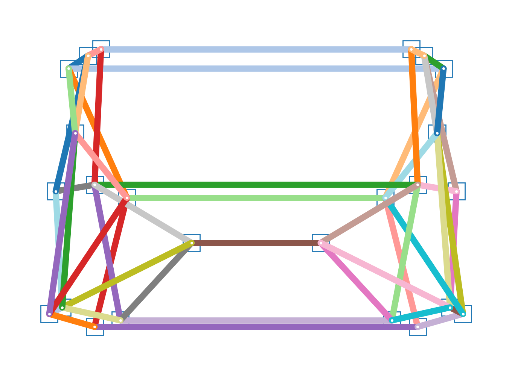

# openpifpaf_apollocar3d

Car keypoints plugin for [OpenPifPaf](https://github.com/vita-epfl/openpifpaf).<br />
[__New__ 2021 paper](https://arxiv.org/abs/2103.02440):

> __OpenPifPaf: Composite Fields for Semantic Keypoint Detection and Spatio-Temporal Association__<br />
> _[Sven Kreiss](https://www.svenkreiss.com), [Lorenzo Bertoni](https://scholar.google.com/citations?user=f-4YHeMAAAAJ&hl=en), [Alexandre Alahi](https://scholar.google.com/citations?user=UIhXQ64AAAAJ&hl=en)_, 2021.
>

## Setup

```
pip3 install openpifpaf
```

(in case CUDA 9 as driver: 
` pip install torch==1.7.0+cu92 torchvision==0.8.1+cu92 -f https://download.pytorch.org/whl/torch_stable.html`)

## Predict 

## Preprocess Dataset
The preprocessing step converts the annotations into the standard COCO format. It also sparsifies the original set of keypoints (90) to a set of 24 keypoints. The resulting pose, from the rear point of view, can be obtained running:
`python -m openpifpaf_apollocar3d.utils.constants`

   

Create (or soft link) the following directories:
* `mkdir data outputs apollo-coco, apollo-coco/images apollo-coco/annotations`
* download and soft link to apollocar3d dataset into `data`
    
```
pip install pandas
pip install opencv-python==4.1.2.30
```
Run:

`python -m openpifpaf_apollocar3d.apollo_to_coco`
The first time, add the argument `--split_images` to copy original images in the new folders according to the train val split


## Pretrained models
Pretrained Shufflenet 16 (AP 76.1%) can be downloaded from [Google Drive](https://drive.google.com/drive/folders/1qaLtifM1_RRWj1KlYlpM3xm0VWbKbsku?usp=sharing)

## Train
Square-edge 769 (AP 76.1%)

```
python3 -m openpifpaf.train --lr=0.00002 --momentum=0.95  --b-scale=5.0 --dataset apollo 
--epochs=300 --lr-decay 160 260 --lr-decay-epochs=10  --weight-decay=1e-5 --apollo-square-edge=769 
--weight-decay=1e-5 --basenet=shufflenetv2k16 --val-interval 10 --loader-workers 16 --apollo-upsample 2 
--apollo-bmin 2 --batch-size 8
```

For smaller memory GPUs: square-edge 513

```
python3 -m openpifpaf.train --dataset apollo \
--basenet=shufflenetv2k16w --apollo-square-edge=513 \
--lr=0.00001 --momentum=0.98 --b-scale=20.0  --epochs=200 \
--lr-decay 130 140 --lr-decay-epochs=10  --weight-decay=1e-5  --loader-workers 16 \
  --val-interval 10 --batch-size 8 --apollo-upsample 2 --apollo-bmin 5
```

## Evaluation
```
CUDA_VISIBLE_DEVICES=0,1 python3 -m openpifpaf.eval --dataset=apollo \
--checkpoint data/models/shufflenetv2k16-201113-135121-apollo.pkl.epoch290 \
--force-complete-pose --seed-threshold=0.01 --instance-threshold=0.01 \
--apollo-eval-long-edge 0
```

## Everything else
All pifpaf options and commands still stand, read more in the
[OpenPifPaf guide](https://vita-epfl.github.io/openpifpaf/intro.html)
